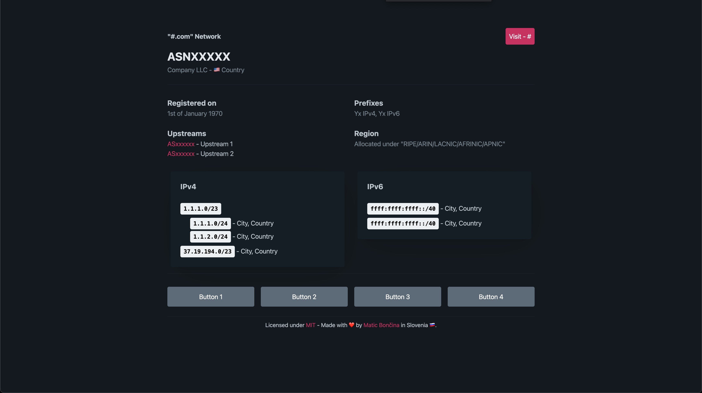

# ASN Information Site Template

Elevate your ASN (Autonomous System Number) display with our stylish and functional ASN page template. Crafted to provide an engaging and informative experience for your customers, this template is an ideal solution to showcase your ASN details.

---

## Table of Contents

- [Introduction](#introduction)
- [Setup and Installation](#setup-and-installation)
- [Customization](#customization)
- [Authors](#authors)
- [How to Contribute](#how-to-contribute)
- [Acknowledgements](#acknowledgements)

---

## Introduction

The ASN Information Site Template is a visually appealing and user-friendly tool designed to present essential information about your Autonomous System Number (ASN) to your customers. Whether you're a network administrator or a business owner, this template simplifies the process of sharing ASN details in a professional and accessible manner.

---

## Setup and Installation

Get your ASN page up and running in no time by following these simple steps:

1. Clone the repository to a web server of your choice, such as cPanel.
2. Replace the template placeholders with your specific ASN information.
3. Customize the appearance by selecting a color scheme from [Pico.css customization options](https://picocss.com/docs/customization.html). We recommend using the "Color Dark scheme (Forced)" from the Pico.css variable generator.

---

## Customization

Further personalize your ASN page by modifying `important.css` with your chosen color variables from the Pico.css site. This allows you to align the template’s look with your brand’s aesthetic.

---

## Authors

- [Matic Bončina](https://github.com/maticboncina) - Lead Developer

---

## How to Contribute

We welcome contributions from the community! To get involved:

- Submit a pull request or open an issue with your proposed changes.

---

## Acknowledgements

- Inspiration: This project was inspired by the functionality and design of [BGP.tools](https://bgp.tools) and various `as<xxxxxx>.net` pages.
- Styling: We've utilized [pico.css](https://picocss.com/) for its sleek and modern design elements.

---